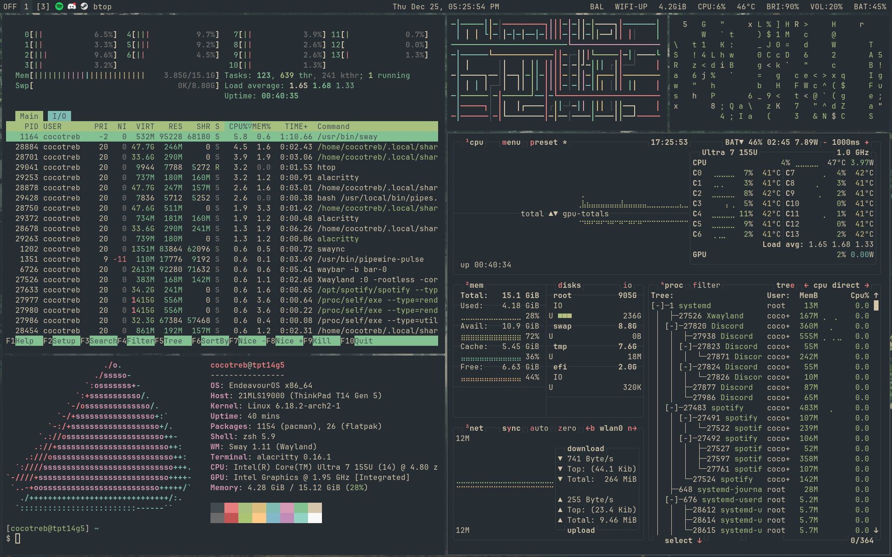
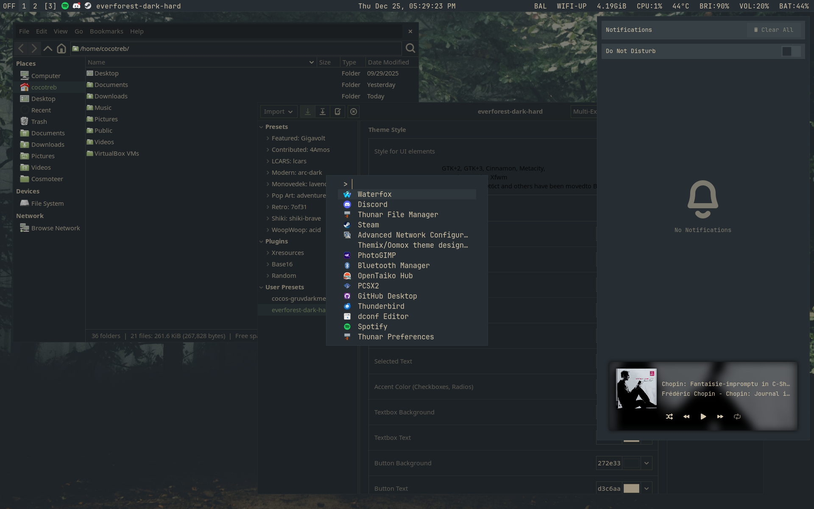

# Personal Dotfiles

These are the dotfiles for my daily driver! I use EndeavourOS alongside SwayWM (with Niri support), but these should work on any distro. Feel free to use these for inspiration or as a template for your own dotfiles.

Keep in mind that these dotfiles aren't drag-and-drop ready and that this repo is mainly for personal use. There are a couple of absolute paths that require you to manually tweak them (the background in the Sway config comes to mind).

## Dependencies:
- sway
- fuzzel
- alacritty
- Phinger Cursors
- neovim
- swaylock
- swaync
- wlogout
- waybar
- zsh w/ oh-my-zsh
### Optional Dependencies:
- btop
- htop
- cava
- Discord and Vencord
- niri

## Display Manager:
I use greetd alongside tuigreet. I highly recommend it if you like the TUI look but want more functionality than a plain TTY.

## Instructions for installation
1. Copy the contents of the `config` folder to `.config`.
2. The chrome folder is for Firefox custom CSS, and is based on [SimpleFox](https://github.com/migueravila/simplefox). Detailed instructions for installation can be found in their repo.
3. The contents of the `themes` and `icons` folders go in the `.themes` and `.icons` folders, respectively.
4. Move `zsh/.zshrc` directly to your home directory. The custom zsh theme goes in `$ZSH/themes/`. 
5. Tweak the filepaths in the config files.
6. Presto! You are ready to go.

## Gallery

