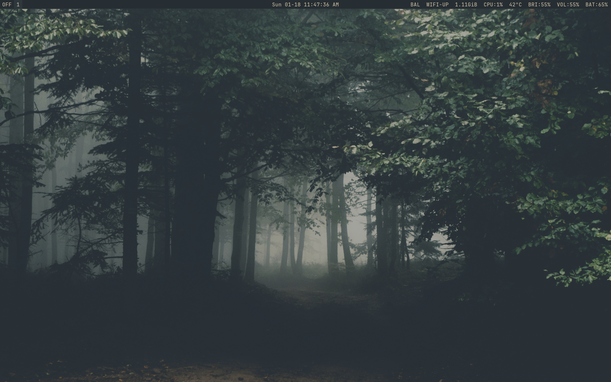
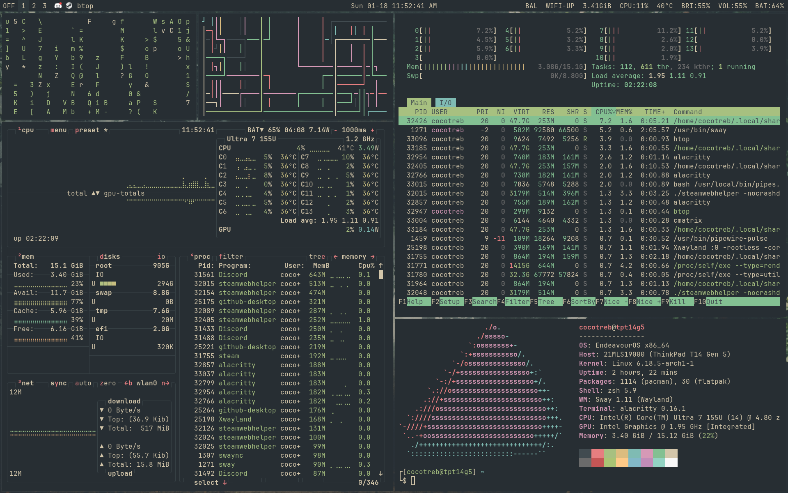
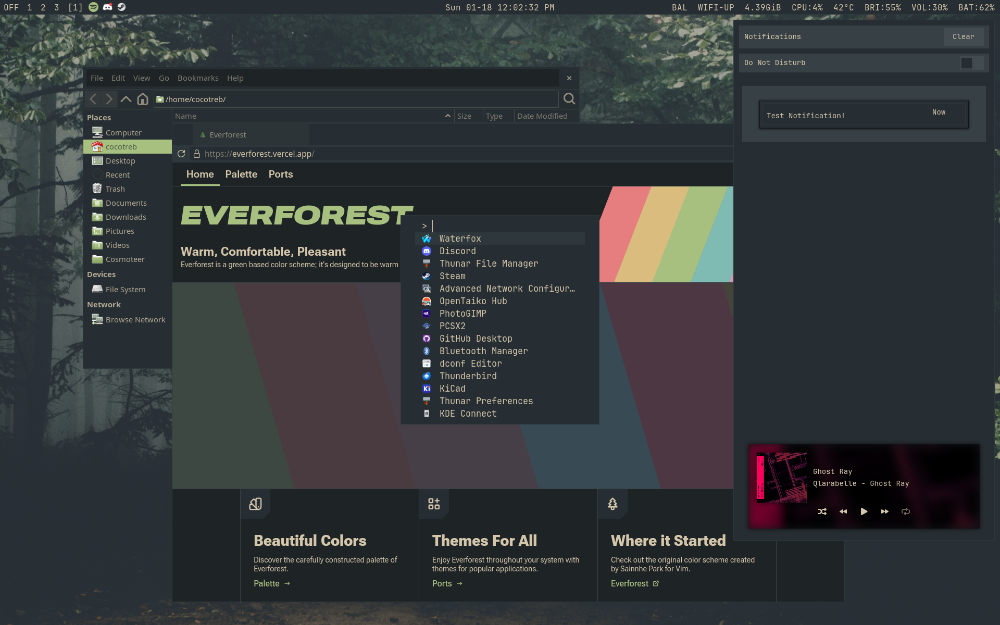

# Everforest Dotfiles

These are sample dotfiles for an Everforest themed Sway setup (with Niri support). They used to be my daily driver before I gave up on modeling them after specific colorschemes altogether. Feel free to use these for inspiration or as a template for your own dotfiles.

## Dependencies:
- sway
- fuzzel
- alacritty
- Phinger Cursors
- neovim
- swaylock
- swaync
- wlogout
- waybar
- zsh w/ oh-my-zsh
### Optional Dependencies:
- btop
- htop
- cava
- Discord and Vencord
- niri
## Background:
My backgrounds are from the repository [Apeiros-46B/everforest-walls](https://github.com/Apeiros-46B/everforest-walls). The specific one I use is `everforest-walls/nature/mist_forest_2.png`.

## Display Manager:
I use greetd alongside tuigreet. I highly recommend it if you like the TUI look but want more functionality than a plain TTY.

## Instructions for installation
1. Copy the contents of the `config` folder to `.config`.
2. The chrome folder is for Firefox custom CSS, and is based on [SimpleFox](https://github.com/migueravila/simplefox). Detailed instructions for installation can be found in their repo.
3. The contents of the `themes` and `icons` folders go in the `.themes` and `.icons` folders, respectively.
4. Move `zsh/.zshrc` directly to your home directory. The custom zsh theme goes in `$ZSH/themes/`.
5. You may need to manually set the GTK theme. I personally use the GUI nwg-look or dconf-editor to do so.
6. Presto! You are ready to go.

## Gallery

